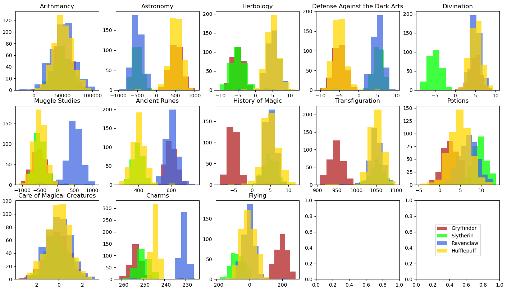
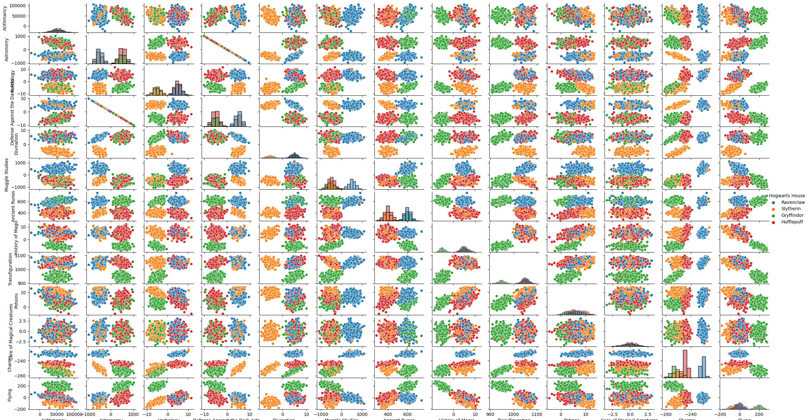

# Welcome to dslr 🧙


This project is about **implementing a logistic regression model** to classify student of **Hogwarts** to their respective houses, according to their marks in the differents subjects.

As we have **four houses**, we will need to implement a **multi-classifier** based on four models that use the principe of **one versus all classifiation**.

A first and very important step of this project is **data analysis** and understanding. This first part is essential if we want to prepare the data properly so the model can be efficiently trained.

# Installation instructions

This project is made with Python. It does not need specific compilation or deployement instructions. Just clone in on your local machine and use it !

```sh
git clone git@github.com:twagger/dslr.git
cd dslr
```

# Basic usage instruction

*Consult dataset metrics*
```sh
python3 describe.py data/dataset_train.csv
```

*Draw histogram with data*
```sh
python3 histogram.py
```

*Draw scatter plot with data*
```sh
python3 scatter_plot.py
```

*Draw pair plot with data*
```sh
python3 pair_plot.py
```

*Train multiclass logistic model*
```sh
python3 logreg_train.py data/dataset_train.py
```

*Predict Hogwarts houses with the trained model*
```sh
python3 logreg_predict.py data/dataset_test.py
```

# Main features

## Data metrics

The `describe.py` program outputs am analysis of the dataset we are using. This analysis is very important to know the data and to properly prepare the data and the learning phase.

```sh
python3 describe.py path/to/dataset.csv
```


## Visual analysis

The visual analysis is here to complete the statistical analysis. In this project we have 3 types of visualization :

* **Histogram** : this diagram shows the **data distribution**
* **Scatter plot** : this diagram shows the **relationship between 2 numerical features**. It is very helpful to identify **correlated data**.
* **Pair plot** : this diagram is a combination of the previous ones. It shows the relationship between the features and the data distribution.

```sh
python3 histogram.py
python3 scatter_plot.py
python3 pair_plot.py
```





## Logistic regression


### Data preparation

After the data analysis phase, we decided to :

- **remove one feature**, highly correlated with another one
- **remove two features**, that have a uniform distribution among different houses
- apply **z-score normalization** on the data

We also chose to replace `nan` and empty values in the dataset with the `mean` value of the feature.

### Training phase

```sh
python3 logreg_training.py path/to/dataset.csv
```

We use 4 logistic regression models in order to classify all the students to their houses.

Each model is focus on classifying one class versus all the others. By default, we are using gradient descent to optimize the parameters. When the training is done, we save the optimized parameters **and** the normalization parameters (mean and standard deviation) in a `parameters.csv` file so we can use proper parameters in the predict program.

### Prediction phase

```sh
python3 logreg_predict.py path/to/dataset.csv
```

The prediction phase just read and load the parameters into 4 logistic regression models, then each model returns the probability that the studied data belongs to the class on which it is specialized.

We then choose the highest probability as the class predicted by our multiclassifier and the program output a `houses.csv` file.

# Extra features

## Multithreading / multiprocessing

As we are training 4 different independent models, we want to do it with parralelism. Ue used multiprocessing to launch the training of each model in a dedicated process, and multithreading to monitor and plot the progression of the training.

The multiprocessing feature has not been set as an option and is done by default.

## Progress bar and training status

As the training phase can be quite long depending on the data, we want to have a visual indication of the remaining time.

We used `tdqm` library to display a progress bar showing the progression of the training. It also will display the model status at the end of the training, if you are training the model with a gradient descent algorithm.


## Plot learning curves while training the models

```sh
python3 logreg_training.py path/to/dataset.csv --plot
```

One very interesting feature we added was the plot of the learning curves of the 4 models during the training.

It allows us to visualy check if the model is really optimizing the loss function and to estimate how many iteration are necessary to have each model trained.


## Chose between 3 different optimization algorithm

```sh
python3 logreg_training.py path/to/dataset.csv --gd GD
python3 logreg_training.py path/to/dataset.csv --gd SGD
python3 logreg_training.py path/to/dataset.csv --gd MBGD
```

In order to manupulate and discover more Gradient Descend algorithms, we implemented :
* Stochastic Gradient Descent
* Mini-Batch Gradient Descent

You can chose to apply them for the training phase and observe their different effect on the learning curve of the models with the `--plot` option.

## Model metrics

```sh
python3 logreg_predict.py path/to/dataset.csv --metrics
```

Sone metrics are particularly useful when it comes to logistic regression :
* **Accuracy** : number of correct predictions over the total predictions
* **Precision** : to what extent can we trust our model when it says a data belongs to a class
* **Recall** : percentage of correct class properly identified by the model
* **F1-score** : harmonious mean between precision and recall


# Libraries used

* Numpy
* Matplotlib
* Seaborn
* tqdm
* threading

# Resources

* [Coursera](https://www.coursera.org/learn/machine-learning) : Andrew Ng's supervised learning course
* [tqdm](https://github.com/tqdm/tqdm) : tqdm documentation
* [Python doc](https://docs.python.org/3/library/threading.html#module-threading) : Documentation about threading in python
* [Python doc](https://docs.python.org/3/library/multiprocessing.html) : Documentation about multiprocessing in python
* [Python doc](https://docs.python.org/3/library/concurrent.futures.html) : Documentation about parallel tasks in python
* [Matplotlib doc](https://matplotlib.org/stable/api/index) Matplotlib general documentation

# Authors

👨 **Thomas WAGNER**

* Github: [@twagger](https://github.com/twagger/)

👨 **César Claude**

* Github: [@cclaude42](https://github.com/cclaude42)

# Credits

* 🖼️ Illustrative image from : **Harry Potter and the Philosopher's Stone**
